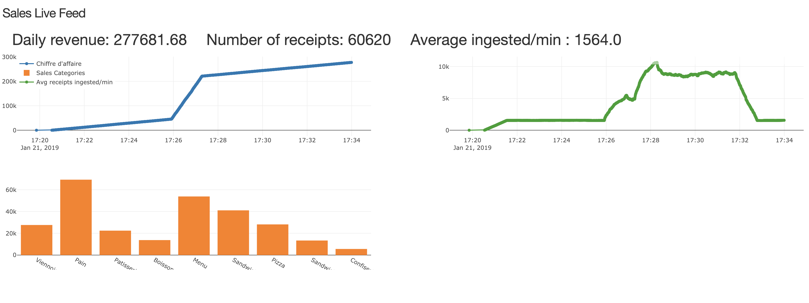

# Streaming Infrastructure

## Goal
The goal of the project is to build a streaming architecture to process a high amount of cash receipts and provide insights on data using a dashboard.

### Typical use case
In our app, we are building a complex architecture to process a high amount of receipts from all stores from a same chain in a specific country.

In our example, we are going to take a chain of 1000 famous French bakeries in France (numbers similar to the Paul brand in France). We estimate that average stores have 4 check counters. We take an average of a minute to generate each receipt (an average person spends approximately this time at the counter).

For those numbers and assuming every counter is open, we can have up to 100 receipts each second.

### Functional specifications
The app has to present metrics in realtime on a dashboard, presented in a webapp. The numbers shown have to represent the sales for the day with the income generated and the total number of sales by category.

Each store will have an app sending the receipt in the JSON format to the system HTTP rest API. This is the standard case but the system has to be able to support more options in the future.

### Technical specifications
The system has to process a lot of information. As we estimated, it should support to up to 200 receipts per second.

Also, the system has to be scalable. More stores can be added or exceptional traffic can happen (during clearance for examples).
The system should be flexible, entrypoints could be added or modified. We should also be able to generate different analytics.

The system has to keep track of all the receipts received, in order to make specific, more complex requests on them.

## Architecture

### Receipts generator
The first task is to generate receipts samples. We use Python for that and a sample of the JSON generated is in [generator/example.json](https://github.com/BScong/streaming-infrastructure/blob/master/generator/example.json). The receipts are then sent to the system entrypoint by an endpoint (REST API).

### Entrypoint
The entrypoint to the system is a HTTP REST API with an endpoint named `/receipt`. It takes receipts in the JSON format and forwards it to the message broker.

The API is deployed in Node.js with [Express.js](https://expressjs.com/). We chose that solution because it is easy to implement and very fast (due to the asynchronous nature of Node.js). It is also flexible as we can define and accept other formats (for example XML or an online form) and we can also define other endpoints very easily.

To send a receipt to the system, send a POST request on `localhost:3000/receipt` with the header `Content-Type` set to `application/json`. Then put the receipt JSON as the body.

### Message broker
For the message broker, we studied different solutions, including RabbitMQ and Apache Kafka.

#### Comparison between Apache Kafka and RabbitMQ

|                         | Apache Kafka                                                                                                       | RabbitMQ                                                                                                                        |
|-------------------------|--------------------------------------------------------------------------------------------------------------------|---------------------------------------------------------------------------------------------------------------------------------|
| Storage                 | Mainly on disk. High amount of values that are store and not consumed immediately.                                 | Mostly on RAM. Works best if values are consumed quickly.                                                                       |
| Routing and logic       | Dumb routing. The clients need to handle the logic (i.e. keeping track of the offset)                              | Complex routing possible. A lot of logic can be handled by RabbitMQ.                                                            |
| Implementation and docs | Young project, few documentation. No official Docker image. For other languages, unofficial clients are available. | Very well documented. An official Docker Image is available and multiple official clients are available in different languages. |
| Dependencies            | Apache Zookeeper                                                                                                   | None                                                                                                                            |
| Scalability             | Horizontal. We can add Kafka nodes.                                                                                | Vertical. We can add more RAM.                                                                                                  |
| Performance             | 100k+ requests/sec                                                                                                 | 20k+ requests/sec (per queue)                                                                                                   |

#### Our choice
We chose to go with RabbitMQ for several reasons:
 - We believe that we must consume data quickly to show real-time analytics, so storage on RAM is better and faster for that usage
 - A basic routing could work for us, but RabbitMQ is better documented and has official Docker images.
 - We like the fact that RabbitMQ keeps track of which message was delivered, and that we won't have to handle that logic.
 - We believe that performance-wise, RabbitMQ is sufficient for our needs.
 - Implementation is made easy for RabbitMQ and docs are complete

#### References
 - [Message-oriented Middleware for Scalable Data Analytics Architectures, NICOLAS NANNONI](http://kth.diva-portal.org/smash/get/diva2:813137/FULLTEXT01.pdf)
 - [Comparatif RabbitMQ / Kafka](https://blog.ippon.fr/2018/03/27/comparatif-rabbitmq-kafka/)
 - [What are the differences between Apache Kafka and RabbitMQ?, Quora](https://www.quora.com/What-are-the-differences-between-Apache-Kafka-and-RabbitMQ)
 - [Understanding When to use RabbitMQ or Apache Kafka, Pivotal](https://content.pivotal.io/blog/understanding-when-to-use-rabbitmq-or-apache-kafka)
 - [Docker image for rabbitmq](https://docs.docker.com/samples/library/rabbitmq/)
 - [RabbitMQ docs](https://www.rabbitmq.com/documentation.html)

#### Implementation
For the implementation, we used [RabbitMQ with Exchanges (Pub/Sub)](https://www.rabbitmq.com/tutorials/tutorial-three-python.html).
We will use several clients, including Python, NodeJS and Java.

For the exchanges, we have:
 - `receipts`: entrypoint for publishing receipts, every receipt JSON is sent on this exchange, and is then consumed by analytics and persistence (database).
 - `count`: published by analytics to increase the current realtime count/sum of receipts, consumed by frontend.
 - `categories`: published by analytics to increase the current realtime count/sum of products for each category. Consumed by frontend.
 - `metrics-db`: published by mongo-client for time metrics for receipts. Consumed by frontend.
 - `metrics-storm`: published by the Storm Topology for metrics for receipts (number of receipts per minute). Consumed by frontend.

Some example code for Java and Python are available in the [utils folder](https://github.com/BScong/streaming-infrastructure/tree/master/utils). They are inspired from [RabbitMQ tutorials](https://github.com/rabbitmq/rabbitmq-tutorials).

### Apache Storm

### Storage of the data
For the database we studied solutions such as MongoDB and Hadoop.

#### Comparison between MongoDB and Hadoop

|                         | Hadoop                                                                                                       | MongoDB                                                                                                                        |
|-------------------------|--------------------------------------------------------------------------------------------------------------------|---------------------------------------------------------------------------------------------------------------------------------|
| Design                 | It is designed to replace RDBMS systems, to process and analyse huge volumes of data.                                 | It is a framework comprised of a software ecosystem, not basically meant to replace RDBMS systems but more as a complement help in archiving data.                                                                       |
| Strength       | Robust and flexible solution.                              | Excels in multi-threaded distribution.                                                            |
| Stotage Format | Stores data in collections, in binary JSON format.  | Stores data in any format. |
| Memory Handling            | Efficient because it is written in C++.                                                                                                   | Better ability to optimize space utilisation.                                                                                                                            |
| Use cases             | More popular for real-time data needs.                                                                                | Efficient for batch jobs.                                                                                                  |

#### Our choice
MongoDB seemed to be a better bet in our case:
 - Firstly, although they are both databases MongoDB is designed to replace RDBMS, while Hadoop acts more as a supplement to help process big volumes of data.  
 - In our case, we need a simple and robust solution to store our data, without the need of a lot of processing.
 - The receipts are already generated in JSON so it suits well Mongo's format.
 - We are not handling huge amounts of data at once, so we don't particularly need efficient batch performance but more of a real-time solution.
 - MongoDB is more simple to use, and in our case we don't need a complex solution but only basic features.

### Presentation
For our presentation layer, we chose to implement a web application to visualise our different measures using Dash.
Dash is a framework by Plotly that is used to easily create analytical and interactive web applications in Python, built on top of Plotly.js, React and Flask.
On the presentation layer, we consume the previously described metrics queues from RabbitMQ and present the current realtime revenue, the sales per category of products and other metrics on the system itself. These metrics are consumed continuously and the graphs are updated every second. Other metrics can easily be added on the dashboard if needed in the future.

#### References
 - [Hadoop Vs. MongoDB: Which Platform is Better for Handling Big Data?](https://aptude.com/blog/entry/hadoop-vs-mongodb-which-platform-is-better-for-handling-big-data/)
 - [Find Out The 9 Best Comparison Between Hadoop vs MongoDB](https://www.educba.com/hadoop-vs-mongodb/)
 - [Apache Hadoop vs MongoDB: Which Is More Secure?](https://www.upguard.com/articles/apache-hadoop-vs.-mongodb-which-is-more-secure)

### Performances
We built a generator sending 1 to 2 receipts every second to our entrypoint by waiting a random amount of time between 0.5s to 1s after each receipt. With that generator, we reach an average of 300 receipts ingested per minute and an average ingestion time of 30 sec.

We built a generator sending 5 to 10 receipts every second to our entrypoint by waiting a random amount of time between 0.1s to 0.2s after each receipt. With that generator, we reach an average of 1500 receipts ingested per minute.

We also built a burst generator that is sending 10,000 receipts to our entrypoint as fast as possible. With that generator, we can reach up to 11,000 receipts ingested per minute.

In the figure below, we generate 5 to 10 receipts per second at the beginning. We then trigger a burst and the number of receipts ingested per minute increases. In blue, the plot represents the total benefits for the day. In green the average number of receipts ingested per minute. The orange plot represents sales by categories.

### Conclusion

### Future improvements
Some improvements can be made to the current system, such as:
 - Automatic scaling, by adding a load balancer or a script monitoring the load, we can detect high bursts of data and automatically scale the system by adding workers or supervisors.
 - Support different file format as input

## Technical documentation

### Getting Started
Install [Docker](https://www.docker.com/get-started) and [Docker Compose](https://docs.docker.com/compose/install/) (automatically installed with Docker in latest versions).
Run `docker-compose up` to run the images (or `docker-compose up -d` in detached mode). Run `docker-compose build` to re-build the images.
When everything is running, the dashboard is available at localhost:8050.

If running in detached mode, you can use `docker-compose ps` to see the processes currently running and `docker-compose stop` to stop them.
To remove the images, run `docker-compose rm`.

Useful links: [Docker Compose Getting Started](https://docs.docker.com/compose/gettingstarted/), [Dockerfile reference](https://docs.docker.com/engine/reference/builder/), [Docker Docs](https://docs.docker.com/), [Docker Getting Started](https://docs.docker.com/get-started/).

### Debugging for Apache Storm

Run `docker-compose build` to build.
Run `docker-compose up --scale storm-supervisor=3` to run with 3 supervisors.
When everything is running, UI should be available at localhost:8080.

To deploy a jar:
 - Generate jar locally from `/storm-topology` with `mvn clean install` and `mvn package`. Copy the jar in `storm-submit/topology-jar`.
 - SSH into storm-submit: Find the storm-submit container id with `docker ps` then execute `docker exec -it STORM-SUBMIT-ID bash`.
 - In the container, `cd ../topology-jar`
 - Import the jar: `storm jar /topology-jar/streaming-topology-1.2.2.jar fr.zhong.streaming.StreamingTopology StreamingTopology` (syntax: `storm jar JAR_PATH TOPOLOGY_CLASS NAME`) or you can also run `./import.sh`
 - Refresh localhost:8080 and topology should appear and be running.
